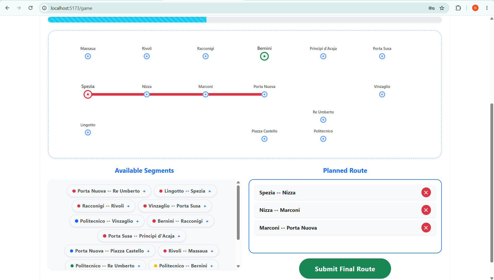
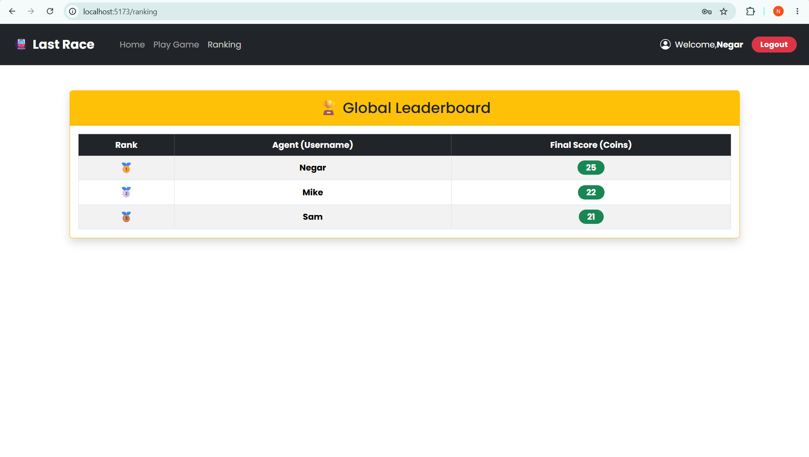

# Exam #1: "The Last Race"

## Student: s355324 REZAEI Negar

## React Client Application Routes

- Route `/`: Landing page explaining the mission rules with a dynamic navigation button based on authentication state.
- Route `/login`: Authentication form for users to access the control room.
- Route `/game`: The core interactive game interface handling Setup, Planning with timer, and Execution phases.
- Route `/ranking`: Displays the global leaderboard fetching the best scores of all agents.
- Route `*`: Fallback 404 page for invalid or non-existent URLs.

## API Server

- POST `/api/sessions`
  - request parameters and request body content: JSON object `{ username, password }`
  - response body content: `200 OK` with user object `{ id, username }` or `401 Unauthorized`
- GET `/api/sessions/current`
  - request parameters: None (uses session cookie)
  - response body content: `200 OK` with user object `{ id, username }` or `401 Unauthorized`
- DELETE `/api/sessions/current`
  - request parameters: None
  - response body content: `200 OK` with an empty object
- GET `/api/game/setup`
  - request parameters: None
  - response body content: `200 OK` with JSON object `{ start, target, minimum_distance, stations, segments, networkMap, coins }`
- POST `/api/game/execute`
  - request parameters and request body content: JSON object `{ startStationId, targetStationId, selectedSegmentIds }`
  - response body content: `200 OK` with JSON object `{ valid, message, finalCoins, log }`
- GET `/api/games/ranking`
  - request parameters: None
  - response body content: `200 OK` with an array of objects `[{ username, score }]` ordered by highest score

## Database Tables

- Table `users` - contains registered users' credentials (id, username, salt, hashed password)
- Table `stations` - contains the network's stations (id, name, is_interchange)
- Table `lines` - contains the metro lines available in the network (id, name, color)
- Table `segments` - contains the network graph defining connections between two stations on a specific line (id, station_a_id, station_b_id, line_id)
- Table `events` - contains the random events and their coin effects (id, description, effect)
- Table `games` - contains logged completed games for the leaderboard (id, user_id, score)

## Main React Components

- `App` (in `App.jsx`): The root component managing the React Router and global layout.
- `AuthProvider` (in `AuthContext.jsx`): Manages and provides the global user authentication state across the application.
- `Navigation` (in `Navigation.jsx`): The persistent top navigation bar handling active links and the logout action.
- `Home` (in `Home.jsx`): Displays instructions and smartly routes the user depending on their session status.
- `Game` (in `Game.jsx`): The engine component controlling timers, map visibility, route selection logic, and sequential event animations.
- `Ranking` (in `Ranking.jsx`): Fetches the top scores from the API and maps them into a leaderboard table.
- `ProtectedRoute` (in `ProtectedRoute.jsx`): A wrapper component that restricts unauthorized access to specific routes.

## Screenshot

## Users Credentials

- Negar, passWord123! (Has previous successful games)
- Sam, 123456789 (Has previous successful games)
- Mike, 123456789

## Use of AI Tools

During the development of this project, AI (Google Gemini) was utilized to brainstorm structural patterns for the React components, assist in generating CSS
